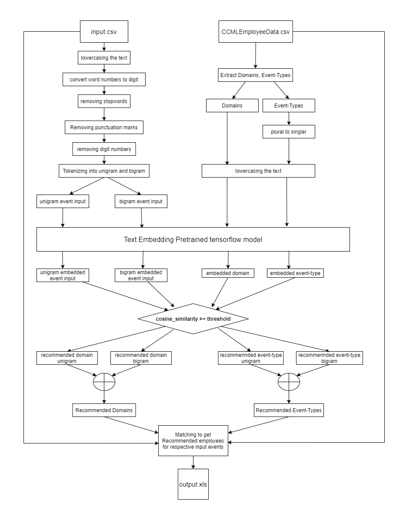

# Unsupervised-Event-Recommender-System-Using-NLP-and-Text-Embeddings

Dependencies for executing code2.py can be installed by running the following command in command prompt/terminal:

    pip install -r requirements.txt
    
    
 ### Jupyter Notebook(code.ipynb) 
    
If Github is Unable to Render the Jupyter Notebook (code.ipynb), 

You can Click Here: 
or

### Detailed Flow Chart

